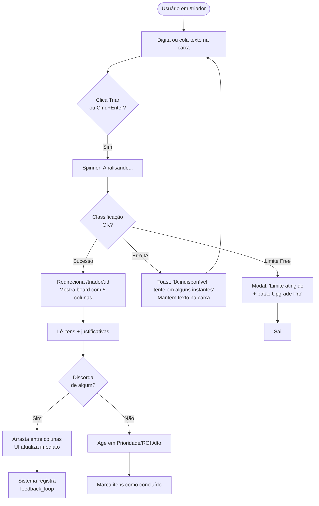
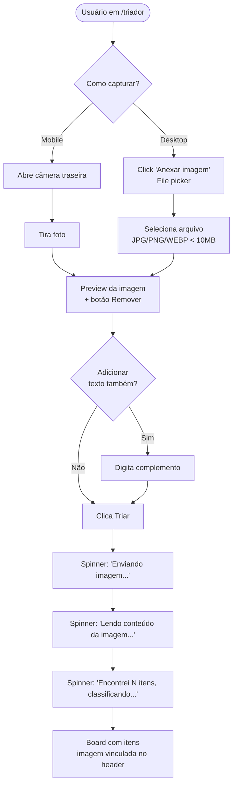
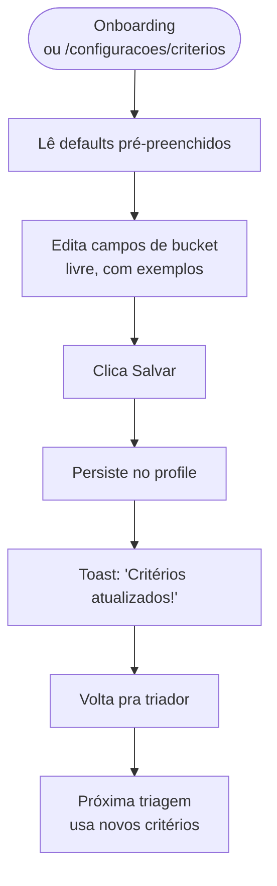
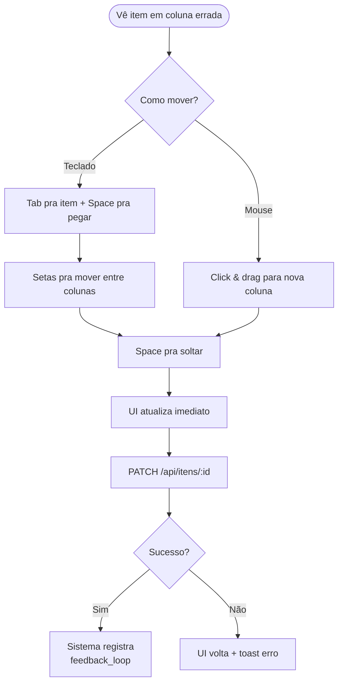
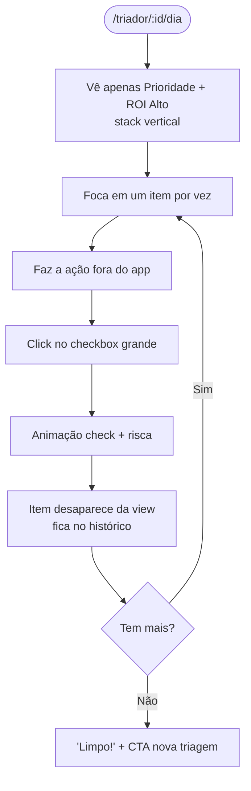

# Triador AI — UI/UX Specification

**Versão:** 0.1 (YOLO Draft)
**Autor:** Uma (UX-Design Expert) com Yuri Gambogi
**Data:** 2026-06-01
**Status:** Draft — aguardando revisão do usuário
**Documentos relacionados:** [PRD v0.1](./prd.md), [Architecture v0.1](./architecture.md)

---

Este documento define os objetivos de UX, arquitetura de informação, fluxos de usuário e especificações visuais do Triador AI. Serve como fundação pro design visual e desenvolvimento frontend, garantindo experiência coesa e centrada no usuário.

---

## 1. Introduction

### 1.1 Overall UX Goals & Principles

#### Target User Personas

- **Yuri (Empreendedor em Tração) — Primária no MVP:** Empreendedor com múltiplas frentes ativas (vendas, operação, conteúdo, parcerias). Vive com 200+ inputs por semana — emails, mensagens, ideias, post-its. Conhecimento técnico básico. Quer ferramenta que **decide por ele**, não que organize manualmente. Tem alta tolerância a IA assumindo o controle, baixa tolerância a fricção.

- **A Consultora Independente (Pro Tier — Epic 5):** Profissional liberal com agenda própria, atendendo 5-15 clientes simultâneos. Caos vem de demandas multi-cliente misturadas com tarefas pessoais. Quer separar contexto rapidamente. Usa principalmente em mobile entre reuniões.

- **O Líder de Squad (Pro Tier — Epic 5+):** Tech lead ou head de equipe pequena. Recebe demandas de cima e da equipe ao mesmo tempo. Já usa Notion/Linear mas precisa de **input bruto rápido** antes de organizar formalmente em ferramentas de squad. Triador é o "pre-processador" do dia.

#### Usability Goals

- **Tempo até primeiro valor:** novo usuário despeja seu primeiro caos e vê classificação em **menos de 90 segundos** desde signup
- **Eficiência de uso recorrente:** usuário power completa o ciclo despejar→triar→agir em **menos de 30 segundos**, dominável por teclado puro
- **Capacidade de aprendizado:** após 5 triagens, a IA deve acertar bucket na primeira tentativa em **≥ 80%** dos itens (medido via taxa de movimentação manual)
- **Memorabilidade:** usuário que volta após 30 dias inativo reconhece o board instantaneamente, sem precisar de tour ou tutorial
- **Prevenção de erros destrutivos:** confirmação sempre em "Descartar triagem", "Excluir histórico", "Cancelar assinatura"

#### Design Principles

1. **A IA é a protagonista, não a assistente** — o usuário não configura buckets, não define regras, não preenche prioridades. Ele despeja. A IA decide. O usuário só **corrige quando discorda**.
2. **Zero fricção na captura, zero pressa na ação** — caixa de input é instantânea e generosa (placeholder convidativo, atalho de teclado, suporte a colar texto longo). Já a ação sobre os itens classificados pode ser deliberada (drag-and-drop visível, justificativa sempre lendo).
3. **Justificativa sempre visível, nunca escondida atrás de clique** — o usuário precisa entender *por que* a IA decidiu o que decidiu. Texto pequeno e cinza ao lado do item. Transparência cria confiança.
4. **Visual zen, dados densos** — espaço em branco generoso na captura. Densidade controlada no board (5 colunas comprimem informação sem virar planilha).
5. **Mobile é PWA, não app reduzido** — em mobile, a captura tem o mesmo poder que no desktop. A diferença é layout (colunas viram tabs/stack), não funcionalidades.

### 1.2 Change Log

| Data       | Versão | Descrição                                          | Autor |
|------------|--------|----------------------------------------------------|-------|
| 2026-06-01 | 0.1    | Criação inicial em modo YOLO                       | Uma   |

---

## 2. Information Architecture (IA)

### 2.1 Site Map / Screen Inventory

```mermaid
graph TD
    Public[/ - Landing pública]
    Login[/login]
    Cadastro[/cadastro]
    Onboarding[/onboarding]

    App[App Autenticado]
    Triador[/triador - Captura]
    BoardTriagem[/triador/:id - Board 5 buckets]
    DiaView[/triador/:id/dia - Visão do Dia]
    Historico[/historico]
    HistoricoTriagem[/historico/:id]
    Configuracoes[/configuracoes]
    Criterios[/configuracoes/criterios]
    Conta[/configuracoes/conta]
    Admin[/admin - Apenas Yuri]

    Public --> Login
    Public --> Cadastro
    Cadastro --> Onboarding
    Onboarding --> Triador
    Login --> Triador

    App --> Triador
    App --> Historico
    App --> Configuracoes
    Triador --> BoardTriagem
    BoardTriagem --> DiaView
    Historico --> HistoricoTriagem
    HistoricoTriagem --> BoardTriagem
    Configuracoes --> Criterios
    Configuracoes --> Conta
```

### 2.2 Navigation Structure

**Primary Navigation (Header, app autenticado):**
- **Logo "Triador"** (esquerda) — sempre leva pra `/triador` (captura)
- **"Triar"** — link pra `/triador` (página principal)
- **"Histórico"** — `/historico`
- **Avatar/menu do usuário** (direita) — dropdown com:
  - Configurações
  - Visão do Dia (atalho pra última triagem em modo foco)
  - Sair

**Secondary Navigation (contextual):**
- Dentro de `/triador/:id` (board): botões "Visão do Dia" + "Exportar" + "Voltar pra captura"
- Dentro de `/configuracoes`: tabs laterais (desktop) ou stack (mobile) — Critérios, Conta

**Breadcrumb Strategy:**
- **Não usamos breadcrumbs.** A IA simplifica navegação a 2-3 níveis máximos. Em mobile, o botão "← Voltar" no header faz o trabalho.

---

## 3. User Flows

### 3.1 Flow: Despejar texto e ver classificação (fluxo principal)

**User Goal:** Tirar o caos da cabeça e ver o que fazer em segundos.

**Entry Points:** `/triador` (após login ou via header), botão "Nova triagem" no histórico.

**Success Criteria:** Usuário vê 5 colunas preenchidas em < 8s, com justificativas lendo, e consegue arrastar um item entre colunas.



**Edge Cases & Error Handling:**
- **Caixa vazia clica Triar:** botão fica desabilitado; não há ação possível
- **Texto > 50.000 chars:** validação bloqueia + mensagem "Texto muito longo, divida em triagens menores"
- **IA retorna 0 itens:** mostra mensagem "Não consegui identificar itens. Reformule ou tente novamente"
- **Conexão perde durante classificação:** texto fica salvo (status `pendente`); ao reconectar, oferece "Retomar classificação"
- **Cmd+Enter no mobile:** atalho não existe; foco é no botão grande

**Notes:** O loading é importante demais pra ser estático. Mostra mensagens dinâmicas em sequência (a cada 1.5s):
1. "Analisando o caos..."
2. "Encontrei {N} itens"
3. "Classificando em 5 buckets..."
4. "Quase lá..."

Cada mensagem reforça que algo está acontecendo (não travou) e ensina implicitamente o que o sistema faz.

---

### 3.2 Flow: Captura por foto/print (Epic 4)

**User Goal:** Capturar o caos visual (mesa, tela, post-it) sem digitar.

**Entry Points:** Botão "Anexar imagem" em `/triador`, botão "Câmera" em mobile.

**Success Criteria:** Imagem vira lista de itens classificados em < 15s.



**Edge Cases & Error Handling:**
- **Imagem ilegível/borrada:** sistema tenta processar; se 0 itens retornados, sugere "Tira outra foto com mais luz" + permite digitar manualmente
- **Imagem > 10MB:** rejeita com mensagem clara + sugere comprimir
- **Formato não suportado (PDF, HEIC):** "Use JPG, PNG ou WEBP"
- **Upload falha (rede):** botão "Tentar novamente" no preview
- **Vision API timeout:** após 30s, fallback para texto manual

---

### 3.3 Flow: Login com Google

**User Goal:** Entrar rápido sem criar senha.

```mermaid
graph TD
    Start([Visitante em /login]) --> Click[Clica 'Entrar com Google']
    Click --> Popup[Abre popup OAuth Google]
    Popup --> Auth{Autenticou?}
    Auth -->|Primeira vez| NovoUsuario[Cria conta + profile]
    Auth -->|Existente| Sessão[Restaura sessão]
    NovoUsuario --> Onboarding[/onboarding]
    Sessão --> Triador[/triador]
    Auth -->|Cancelou| Volta[Volta /login]
```

**Edge Cases:**
- **Popup bloqueado:** mensagem "Permita popups pra fazer login com Google"
- **Email já existe com senha:** Supabase faz merge automático se email bater
- **Sem internet durante OAuth:** mensagem clara + retry

---

### 3.4 Flow: Definir critérios pessoais (Epic 3 Story 3.1)

**User Goal:** Ensinar a IA o que é prioridade pra ele.



**Edge Cases:**
- **Critérios muito vagos:** sem validação dura, mas tooltip sugere "Quanto mais específico, melhor a IA classifica"
- **Quer voltar pros padrões:** botão "Restaurar padrões"

---

### 3.5 Flow: Drag-and-drop entre buckets

**User Goal:** Corrigir classificação errada da IA.



**Edge Cases:**
- **Soltar fora de coluna válida:** item volta pra posição original com animação suave
- **Múltiplos movimentos rápidos:** debounce 300ms antes de chamar API
- **Leitor de tela:** anúncio "Item movido de Depois para Prioridade"

---

### 3.6 Flow: Concluir item na Visão do Dia

**User Goal:** Executar sem distração.



---

## 4. Wireframes & Mockups

### 4.1 Design Files

**Primary Design Files:** *Pendente.* No MVP, wireframes vivem como ASCII art neste documento + componentes implementados no Storybook (Epic 1 stretch). Sem Figma no MVP — Yuri vai validar diretamente no app rodando.

**Recomendação futura:** Quando contratar designer ou refinar visual no Epic 3+, mover pra Figma e referenciar aqui.

### 4.2 Key Screen Layouts

#### Screen 1: Tela de Captura (`/triador`)

**Purpose:** Ponto de entrada zen. Convidar despejo sem fricção.

**Key Elements:**
- Header minimalista (logo + nav + avatar)
- Caixa de texto gigante (textarea) ocupando 60% da viewport, com placeholder "Despeje tudo. Eu organizo depois."
- Contador de caracteres discreto no canto inferior direito (cinza, aparece só quando há texto)
- Botão "Triar" abaixo da caixa, à direita (primário, vermelho-laranja queimado quando ativo)
- Botão "Anexar imagem" à esquerda do "Triar" (secundário, ícone Phosphor `image-square`)
- Atalho `Cmd/Ctrl + Enter` mostrado em microcopy abaixo do botão Triar (`⌘↵ pra triar`)

**Interaction Notes:**
- Textarea cresce automaticamente até 80% da viewport (depois scroll interno)
- Foco automático no carregamento da página (cursor já pronto pra digitar)
- Botão Triar fica disabled (opacidade 50%) se texto vazio
- Estado "Triar enviado": botão vira spinner + texto "Analisando..."

**Wireframe ASCII (Desktop):**

```
┌────────────────────────────────────────────────────────────────┐
│  ⌂ Triador      Triar    Histórico              🟣 Yuri ▼      │
├────────────────────────────────────────────────────────────────┤
│                                                                │
│                                                                │
│   ┌─────────────────────────────────────────────────────────┐  │
│   │                                                         │  │
│   │  Despeje tudo. Eu organizo depois.                      │  │
│   │                                                         │  │
│   │                                                         │  │
│   │                                                         │  │
│   │                                                         │  │
│   │                                                         │  │
│   │                                                         │  │
│   │                                              0/50000   │  │
│   └─────────────────────────────────────────────────────────┘  │
│                                                                │
│            ▢ Anexar imagem            🟠 Triar                 │
│                                       ⌘↵ pra triar             │
│                                                                │
│                                                                │
└────────────────────────────────────────────────────────────────┘
```

**Wireframe ASCII (Mobile):**

```
┌─────────────────────────┐
│ ⌂ Triador          ☰   │
├─────────────────────────┤
│                         │
│ ┌─────────────────────┐ │
│ │                     │ │
│ │ Despeje tudo. Eu    │ │
│ │ organizo depois.    │ │
│ │                     │ │
│ │                     │ │
│ │                     │ │
│ │                     │ │
│ │             0/50k   │ │
│ └─────────────────────┘ │
│                         │
│ ▢ Imagem        🟠 Triar│
│                         │
└─────────────────────────┘
```

---

#### Screen 2: Board Kanban (`/triador/:id`)

**Purpose:** Mostrar de relance o que fazer com cada coisa.

**Key Elements:**
- Header com data/hora da triagem + botões "Visão do Dia", "Exportar", "← Nova Triagem"
- 5 colunas lado a lado (desktop): Prioridade, ROI Alto, Delega, Depois, Descarta
- Cada coluna tem header colorido com ícone + nome + contador de itens
- Cards de item dentro de cada coluna (vertical stack, scroll independente por coluna)
- Card mostra: texto do item (negrito) + justificativa em cinza menor abaixo
- Card tem alça de drag (ícone Phosphor `dots-six-vertical`) só visível no hover
- Coluna vazia mostra placeholder elegante ("Nada por aqui")

**Interaction Notes:**
- Hover no card: leve elevação (shadow) + alça de drag aparece
- Drag em curso: card vira semi-transparente + colunas válidas pulsam suavemente
- Drop: animação spring de "encaixar"
- Click no card abre dialog com ações: "Concluir", "Editar bucket", "Gatilho de retorno" (se em Depois), "Delegar" (se em Delega), "Excluir"

**Wireframe ASCII (Desktop, 5 colunas):**

```
┌──────────────────────────────────────────────────────────────────────────────┐
│ ← Nova   01/Jun/2026 14:32 · 12 itens          ☀ Visão do Dia    ⬇ Exportar│
├──────────────────────────────────────────────────────────────────────────────┤
│                                                                              │
│ 🔥 PRIORIDADE 3│ 💰 ROI ALTO  2 │ 🤝 DELEGA  2  │ ⏸️ DEPOIS  3  │ 🗑 DESCARTA 2│
│ ━━━━━━━━━━━━━━ ━━━━━━━━━━━━━━━ ━━━━━━━━━━━━━━━ ━━━━━━━━━━━━━━━ ━━━━━━━━━━━━│
│ ┌────────────┐ ┌──────────────┐ ┌─────────────┐ ┌─────────────┐ ┌──────────│
│ │Ligar Marcos│ │Proposta XPTO │ │Postar Insta │ │Curso copy   │ │Newsletter│
│ │proposta    │ │R$ 15k        │ │newsletter   │ │             │ │TechWeekly│
│ │            │ │              │ │             │ │             │ │          │
│ │Cliente espe│ │Lead quente   │ │Mais rápido  │ │Sem urgência │ │Não leio  │
│ │rando 2 dias│ │perto fechar  │ │delegar      │ │claro hoje   │ │há meses  │
│ └────────────┘ └──────────────┘ └─────────────┘ └─────────────┘ └──────────│
│ ┌────────────┐ ┌──────────────┐ ┌─────────────┐ ┌─────────────┐ ┌──────────│
│ │Resposta DRE│ │Parceria Vale │ │Aprovar arte │ │Estudar nego │ │Boletim BC│
│ │contador    │ │revenue share │ │post sexta   │ │stack 2027   │ │          │
│ │            │ │              │ │             │ │             │ │          │
│ │Prazo amanhã│ │Pode dobrar   │ │Designer mais│ │Não pra agora│ │Sem ação  │
│ │            │ │MRR Q4        │ │capacitado   │ │             │ │possível  │
│ └────────────┘ └──────────────┘ └─────────────┘ └─────────────┘ └──────────│
│ ┌────────────┐                                  ┌─────────────┐            │
│ │Reservar voo│                                  │Ligar Joana  │            │
│ │SP 15/06    │                                  │próxima sema │            │
│ │            │                                  │             │            │
│ │Preço sobe  │                                  │Lembrete sex │            │
│ │após sexta  │                                  │              │            │
│ └────────────┘                                  └─────────────┘            │
│                                                                              │
└──────────────────────────────────────────────────────────────────────────────┘
```

**Wireframe ASCII (Mobile, tabs horizontais):**

```
┌─────────────────────────┐
│ ← 01/Jun · 12 itens  ⋮ │
├─────────────────────────┤
│ 🔥 💰 🤝 ⏸️ 🗑          │ ← tabs com badges
│  3  2  2  3  2          │
├─────────────────────────┤
│ 🔥 PRIORIDADE           │
│ ┌─────────────────────┐ │
│ │ Ligar Marcos        │ │
│ │ Cliente esperando   │ │
│ │ 2 dias              │ │
│ └─────────────────────┘ │
│ ┌─────────────────────┐ │
│ │ Resposta DRE        │ │
│ │ contador            │ │
│ │ Prazo amanhã        │ │
│ └─────────────────────┘ │
│ ┌─────────────────────┐ │
│ │ Reservar voo SP     │ │
│ │ Preço sobe sex      │ │
│ └─────────────────────┘ │
└─────────────────────────┘
```

---

#### Screen 3: Visão do Dia (`/triador/:id/dia`)

**Purpose:** Modo foco. Sem distração. Executar o crítico.

**Key Elements:**
- Header simplificado (só logo + "Sair da Visão do Dia")
- Apenas 2 seções: Prioridade (em cima, fundo levemente vermelho) e ROI Alto (em baixo, fundo levemente verde)
- Cards maiores que no board (mais espaço pra ler)
- Checkbox grande à esquerda de cada card (touch-friendly mobile)
- Quando marca concluído: animação satisfatória (check verde + risca + slide out)
- Quando lista esvazia: ilustração + texto "Limpo! Que tal capturar mais? [Botão Nova Triagem]"

**Interaction Notes:**
- Otimizado pra mobile (stack vertical)
- Em desktop, conteúdo centralizado com largura máx 720px (legibilidade)
- Itens concluídos somem da view mas ficam no histórico

**Wireframe ASCII (Mobile):**

```
┌─────────────────────────┐
│ ⌂ Triador      Sair    │
├─────────────────────────┤
│                         │
│ 🔥 PRIORIDADE  (3)      │
│                         │
│ ┌─────────────────────┐ │
│ │ ☐  Ligar Marcos     │ │
│ │    proposta         │ │
│ │                     │ │
│ │    Cliente esperan- │ │
│ │    do 2 dias        │ │
│ └─────────────────────┘ │
│ ┌─────────────────────┐ │
│ │ ☐  Resposta DRE     │ │
│ │    contador         │ │
│ │                     │ │
│ │    Prazo amanhã     │ │
│ └─────────────────────┘ │
│                         │
│ 💰 ROI ALTO  (2)        │
│                         │
│ ┌─────────────────────┐ │
│ │ ☐  Proposta XPTO    │ │
│ │    R$ 15k           │ │
│ │                     │ │
│ │    Lead quente perto│ │
│ │    de fechar        │ │
│ └─────────────────────┘ │
└─────────────────────────┘
```

---

#### Screen 4: Histórico (`/historico`)

**Purpose:** Revisitar triagens passadas.

**Key Elements:**
- Header padrão
- Filtros no topo: busca textual + range de datas
- Lista de cards de triagem em ordem cronológica decrescente
- Cada card: data/hora destaque, contador de itens por bucket (mini-chips), preview dos 3 primeiros itens (texto cortado em 60 chars), botão "Ver triagem completa →"
- Estado vazio: ilustração + "Sem triagens ainda. [Criar primeira]"

**Wireframe ASCII (Desktop):**

```
┌──────────────────────────────────────────────────────────────┐
│ ⌂ Triador      Triar    Histórico              🟣 Yuri ▼     │
├──────────────────────────────────────────────────────────────┤
│  HISTÓRICO                                                   │
│  ┌─────────────────────────────────┐  📅 [01/05 — 01/06]    │
│  │ 🔍 Buscar nos itens...          │                        │
│  └─────────────────────────────────┘                        │
│                                                              │
│  ┌──────────────────────────────────────────────────────┐   │
│  │ 01/Jun 14:32 · 12 itens                              │   │
│  │ 🔥3  💰2  🤝2  ⏸️3  🗑2                              │   │
│  │ • Ligar Marcos proposta                              │   │
│  │ • Resposta DRE contador                              │   │
│  │ • Reservar voo SP 15/06                              │   │
│  │                                      Ver completa → │   │
│  └──────────────────────────────────────────────────────┘   │
│                                                              │
│  ┌──────────────────────────────────────────────────────┐   │
│  │ 31/Mai 09:15 · 8 itens                               │   │
│  │ 🔥2  💰1  🤝1  ⏸️2  🗑2                              │   │
│  │ • Revisar contrato MarketLab                         │   │
│  │ • Agendar mentoria Bruno                             │   │
│  │ • Atualizar pitch deck                               │   │
│  │                                      Ver completa → │   │
│  └──────────────────────────────────────────────────────┘   │
└──────────────────────────────────────────────────────────────┘
```

---

#### Screen 5: Onboarding (`/onboarding`)

**Purpose:** Em 4 telas, ensinar o que o produto faz e dar primeira vitória.

**Key Elements:**
- Stepper visual no topo (4 bolinhas)
- Tela 1: Boas-vindas + explicação dos 5 buckets (visual com ícones grandes + 1 linha cada)
- Tela 2: "Vamos triar juntos" — caixa pré-preenchida com exemplo + botão "Triar"
- Tela 3: Board com resultado classificado + microcopy explicando "Olha como ficou organizado"
- Tela 4: Critérios pessoais (simplificado, 1 campo só: "O que é prioridade pra você?") + botão "Pronto, vamos lá"
- Botão "Pular" em todas as telas (canto superior direito)

**Wireframe ASCII (Tela 1):**

```
┌─────────────────────────────────────────────┐
│ Triador                          Pular →    │
├─────────────────────────────────────────────┤
│         ● ○ ○ ○                             │
│                                             │
│       Bem-vindo ao Triador 👋               │
│                                             │
│  Você joga o caos.                          │
│  A IA organiza em 5 buckets:                │
│                                             │
│   🔥 PRIORIDADE — Faz agora                 │
│   💰 ROI ALTO — Move a agulha               │
│   🤝 DELEGA — Outro faz                     │
│   ⏸️ DEPOIS — Não esquece, mas espera        │
│   🗑 DESCARTA — Libera mente                │
│                                             │
│                                             │
│                          Próximo →          │
└─────────────────────────────────────────────┘
```

---

#### Screen 6: Configurações > Critérios (`/configuracoes/criterios`)

**Key Elements:**
- Sidebar (desktop) ou tabs (mobile): Critérios | Conta
- Form com 5 campos textarea (um por bucket), cada um com label colorido + descrição + exemplo de placeholder
- Botão "Salvar" + "Restaurar padrões" no rodapé
- Microcopy no topo: "Defina o que cada categoria significa pra você. A IA usa isso pra classificar."

---

## 5. Component Library / Design System

### 5.1 Design System Approach

**Strategy:** Sistema próprio leve construído **sobre Shadcn/ui** (que por baixo usa Radix UI), com tokens customizados via Tailwind 4. Não vamos fazer um design system do zero — Shadcn já entrega 90% acessível, e a gente customiza tokens (cores, espaçamento, tipografia) pra ter identidade.

**Atomic Design:**
- **Átomos:** Button, Input, Textarea, Badge, Icon, Avatar, Checkbox, Toast, Skeleton, Spinner
- **Moléculas:** FormField (Label + Input + Error), BucketBadge (Icon + Label + Count), ItemCard, EmptyState, ToggleGroup
- **Organismos:** BucketColumn, BoardView, CaptureBox, ImageUploader, HistoricoCard, OnboardingStep, AppHeader
- **Templates:** AppShell (Header + main), AuthShell (centralizado), MarketingShell
- **Páginas:** /triador, /triador/:id, /historico, etc.

### 5.2 Core Components

#### 5.2.1 Button

**Purpose:** Ação primária ou secundária.

**Variants:**
- `primary` — vermelho-laranja queimado (mesma cor do bucket Prioridade), texto branco, alta saliência. Usar para CTA principal por tela (ex: "Triar", "Salvar").
- `secondary` — fundo branco, borda cinza, texto preto. Para ações secundárias (ex: "Cancelar", "Voltar").
- `ghost` — sem fundo, sem borda, hover suave. Para ações terciárias dentro de menus.
- `destructive` — vermelho puro (`#DC2626`). Para "Excluir", "Cancelar assinatura".
- `link` — visual de link inline, sublinhado no hover.

**Sizes:** `sm` (h-8), `md` (h-10, default), `lg` (h-12, mobile-friendly).

**States:** default, hover, focus (ring offset 2 cor primária), active, disabled (opacidade 50, cursor not-allowed), loading (spinner + texto cinza).

**Usage Guidelines:**
- Apenas 1 botão `primary` visível por tela
- `destructive` sempre acompanhado de modal de confirmação
- Não usar emojis em label de botão; usar ícones Phosphor

---

#### 5.2.2 Input / Textarea

**Purpose:** Captura de texto.

**Variants:**
- `input` — single line, padding interno generoso (px-4 py-2.5)
- `textarea` — multi-line, resize controlado (none ou vertical)
- `search` — com ícone Phosphor `magnifying-glass` à esquerda

**States:** default (borda cinza), focus (borda primária + ring), error (borda vermelha + texto auxiliar vermelho), disabled (fundo cinza claro), readonly (sem borda, fundo transparente).

**Usage Guidelines:**
- Toda Input dentro de Form precisa de Label associada (acessibilidade)
- Placeholder não substitui Label — usar Label visível ou `aria-label`
- Validação inline ao blur, não ao change (menos irritante)

---

#### 5.2.3 ItemCard (molécula)

**Purpose:** Representar 1 item classificado dentro de uma coluna.

**Estrutura:**
- Borda lateral colorida (4px) na cor do bucket — pista visual mesmo se mover entre colunas
- Padding `p-3`
- Texto do item: font medium, text-sm, color foreground
- Justificativa: font regular, text-xs, color muted-foreground, max-height 2 linhas com ellipsis
- Alça de drag: ícone Phosphor `dots-six-vertical`, color muted, opacity-0 → opacity-100 on hover
- Click no card abre dialog de ações

**States:**
- `default`
- `hover` — leve elevação (shadow-sm → shadow-md)
- `dragging` — opacity-50 + rotate-2
- `concluido` — opacity-60 + text-decoration line-through

---

#### 5.2.4 BucketColumn (organismo)

**Purpose:** 1 das 5 colunas do board.

**Estrutura:**
- Header sticky: ícone Phosphor + label do bucket (uppercase, text-sm) + badge com contador
- Cor de fundo do header levemente tintada na cor do bucket (5% opacity)
- Body: scroll vertical, cards empilhados com gap-2
- Estado vazio: ilustração simples + "Nada por aqui"
- Drop zone: feedback visual quando arrasta sobre

---

#### 5.2.5 Toast (notificação)

**Purpose:** Feedback rápido após ações.

**Variants:**
- `success` — verde, ícone `check-circle`
- `error` — vermelho, ícone `warning-circle`
- `info` — azul, ícone `info`
- `warning` — amarelo, ícone `warning`

**Position:** bottom-right (desktop), bottom-center (mobile)
**Duration:** 4s default, 8s pra erros (pra usuário ler)
**Lib:** Sonner (compatível com Shadcn)

---

#### 5.2.6 Dialog / Modal

**Purpose:** Confirmações destrutivas, ações detalhadas (gatilho de retorno, gerar mensagem de delegação).

**Variants:**
- `default` — centered, max-w-md
- `large` — centered, max-w-2xl
- `drawer` (mobile) — slide up from bottom

**Accessibility:** Foco trap, Escape fecha, click backdrop fecha (configurável), aria-modal.

---

#### 5.2.7 Skeleton

**Purpose:** Loading state que evita layout shift.

Usar em: carregamento de board, lista de histórico, carregamento inicial de página autenticada.

---

#### 5.2.8 EmptyState (molécula)

**Purpose:** Tela vazia bem desenhada.

**Estrutura:**
- Ilustração ou ícone grande (Phosphor `tray` ou similar)
- Título empático (ex: "Sem triagens ainda")
- Subtítulo com ação (ex: "Cria sua primeira em segundos")
- Botão CTA primário

---

## 6. Branding & Style Guide

### 6.1 Visual Identity

**Brand Guidelines:** Não há manual de marca formal no MVP. Identidade visual emerge das escolhas deste documento. Quando contratar designer formal, esta seção vira referência inicial.

**Personalidade da marca:**
- **Calmo e direto** (não vibrante demais — competidor de produtividade não pode parecer joguinho)
- **Confiante** (sabe o que faz, não pede permissão)
- **Pragmático** (sem floreios, sem ilustrações desnecessárias)

### 6.2 Color Palette

| Color Type | Hex Code | Usage |
|------------|----------|-------|
| **Primary** | `#E74C3C` | Botões primários, Bucket Prioridade, links em destaque |
| **Secondary** | `#27AE60` | Bucket ROI Alto, success states, indicadores positivos |
| **Accent** | `#3498DB` | Bucket Delega, links secundários, info |
| **Bucket: Depois** | `#7F8C8D` | Bucket Depois (cinza-azulado) |
| **Bucket: Descarta** | `#BDC3C7` | Bucket Descarta (cinza claro) |
| **Success** | `#27AE60` | Confirmações, toasts de sucesso |
| **Warning** | `#F39C12` | Avisos não-críticos, limite Free próximo |
| **Error / Destructive** | `#DC2626` | Erros, ações destrutivas |
| **Foreground** | `#0F172A` | Texto principal (slate-900) |
| **Muted Foreground** | `#64748B` | Texto secundário (slate-500), justificativas |
| **Background** | `#FFFFFF` | Fundo padrão (light mode) |
| **Background Dark** | `#0B1120` | Fundo padrão (dark mode — slate-950 ajustado) |
| **Card** | `#FFFFFF` | Fundo de cards (light) |
| **Card Dark** | `#1E293B` | Fundo de cards (dark — slate-800) |
| **Border** | `#E2E8F0` | Bordas (slate-200) |
| **Border Dark** | `#334155` | Bordas (dark — slate-700) |

**Dark mode:** suportado desde o MVP. Toggle no menu do usuário. Defaults pra system preference.

**Contrast Check (WCAG AA):**
- Foreground sobre Background: ratio 19.6:1 ✓ (AAA)
- Primary sobre Background: 4.7:1 ✓ (AA)
- Muted sobre Background: 5.1:1 ✓ (AA)
- White sobre Primary: 4.8:1 ✓ (AA)

### 6.3 Typography

#### Font Families

- **Primary:** **Inter** (sans-serif, Google Fonts) — clean, neutra, otimizada pra UI, suporta latin extended (pt-BR)
- **Display:** **Inter** com weight 700 — sem family separada pra reduzir bundle
- **Monospace:** **JetBrains Mono** — apenas se necessário (não previsto no MVP)

**Loading:** via `next/font/google` com `display: 'swap'` e subset `latin`.

#### Type Scale

Sistema 1.250 (Major Third) com base 16px.

| Element | Size | Weight | Line Height | Tailwind |
|---------|------|--------|-------------|----------|
| H1 | 36px | 700 | 1.2 | `text-4xl font-bold leading-tight` |
| H2 | 30px | 700 | 1.25 | `text-3xl font-bold leading-tight` |
| H3 | 24px | 600 | 1.3 | `text-2xl font-semibold leading-snug` |
| H4 | 20px | 600 | 1.4 | `text-xl font-semibold` |
| Body Large | 18px | 400 | 1.6 | `text-lg leading-relaxed` |
| Body | 16px | 400 | 1.5 | `text-base` |
| Body Small | 14px | 400 | 1.5 | `text-sm` |
| Caption | 12px | 400 | 1.4 | `text-xs` |
| Mono (raro) | 14px | 400 | 1.5 | `font-mono text-sm` |

### 6.4 Iconography

**Icon Library:** **Phosphor Icons** 2.x (`@phosphor-icons/react`)

**Weights disponíveis:** `regular` (default), `bold`, `fill`, `duotone`. Padrão UI: `regular`. Estados ativos/preenchidos: `fill`.

**Tamanhos canônicos:**
- 16px (`size={16}`) — inline em texto pequeno
- 20px (default em botões/inputs)
- 24px — header de coluna, ações principais
- 32px — vazias states, onboarding
- 48px+ — ilustrações decorativas

**Mapeamento bucket → ícone:**
- 🔥 Prioridade → `Fire` (weight bold)
- 💰 ROI Alto → `CurrencyCircleDollar` (weight bold)
- 🤝 Delega → `Handshake`
- ⏸️ Depois → `PauseCircle`
- 🗑 Descarta → `Trash`

**Outros ícones críticos:**
- Header logo: SVG custom (a fazer; placeholder texto "Triador" no MVP)
- Captura imagem: `ImageSquare`
- Câmera: `Camera`
- Concluído: `CheckCircle` (fill)
- Exportar: `DownloadSimple`
- Sair: `SignOut`
- Drag handle: `DotsSixVertical`
- Busca: `MagnifyingGlass`
- Menu/avatar: `User` ou `CaretDown`
- Erro: `WarningCircle`
- Sucesso: `CheckCircle`
- Info: `Info`

**Usage Guidelines:**
- **PROIBIDO usar Lucide ou outros libs de ícones.** Apenas Phosphor + SVGs customizados.
- Ícones sempre com `aria-label` quando ação solo (sem texto).
- Quando há ícone + texto, `aria-hidden="true"` no ícone (Label já comunica).
- Manter weight consistente por seção (não misturar regular + bold no mesmo grupo).

### 6.5 Spacing & Layout

**Grid System:** sem grid formal (não usamos grid 12-col tradicional). Layout via Flexbox/CSS Grid via Tailwind. Container central com `max-w-7xl mx-auto px-4 md:px-6`.

**Spacing Scale (Tailwind padrão 4px):**

| Token | Pixels | Uso |
|-------|--------|-----|
| `0` | 0 | Reset |
| `1` | 4px | Gap entre ícone e texto |
| `2` | 8px | Padding compacto |
| `3` | 12px | Padding cards |
| `4` | 16px | Padding default |
| `6` | 24px | Gap entre seções pequenas |
| `8` | 32px | Gap entre seções médias |
| `12` | 48px | Gap entre blocos grandes |
| `16` | 64px | Margem de seções de página |

**Border Radius:**
- `rounded-sm` (2px) — quase ninguém
- `rounded` (4px) — inputs, badges
- `rounded-md` (6px) — botões padrão
- `rounded-lg` (8px) — cards
- `rounded-xl` (12px) — modais
- `rounded-full` — avatars, ícones em círculo

**Shadows:**
- `shadow-sm` — cards default
- `shadow-md` — cards hover, dropdowns
- `shadow-lg` — modais
- `shadow-xl` — destaque máximo (raro)

---

## 7. Accessibility Requirements

### 7.1 Compliance Target

**Standard:** **WCAG 2.2 AA**

Justificativa: AA é o equilíbrio prático entre rigor e velocidade de entrega no MVP. AAA seria desejável mas custa muito (contraste 7:1 limita paleta). Auditoria via axe-core no CI.

### 7.2 Key Requirements

**Visual:**
- **Color contrast ratios:** mínimo 4.5:1 pra texto normal, 3:1 pra texto grande (≥18pt) e elementos UI; cores dos buckets isoladamente nunca comunicam significado (sempre acompanhadas de ícone + label)
- **Focus indicators:** ring 2px na cor primária com offset 2px em todos os elementos interativos. Nunca remover outline sem substituto visível.
- **Text sizing:** usuário pode usar zoom até 200% sem perder funcionalidade; usar `rem` em vez de `px` quando possível

**Interaction:**
- **Keyboard navigation:** 100% do app navegável por teclado. Atalhos documentados:
  - `Cmd/Ctrl + Enter` — triar
  - `Tab/Shift+Tab` — navegar entre itens
  - `Space` — pegar/soltar item no drag (dnd-kit)
  - `Setas` — mover item entre colunas (com Space ativo)
  - `1-5` — atalho pra mover item focado pra bucket N
  - `Esc` — fechar dialog/menu
- **Screen reader support:** ARIA labels em todos os botões só-ícone; `aria-live="polite"` no toast e em mudanças de bucket; landmarks (`main`, `nav`, `header`, `aside`)
- **Touch targets:** mínimo 44x44px em mobile (recomendação WCAG); botões `lg` em viewport sm

**Content:**
- **Alternative text:** todas imagens upload do usuário recebem `alt` (vazio se decorativo, descritivo se conteúdo); ícones decorativos `aria-hidden="true"`
- **Heading structure:** hierarquia respeitada (H1 único por página, H2 pra seções, H3 pra subseções); não pular níveis
- **Form labels:** todo Input tem Label associada via `htmlFor`/`id` ou `aria-label`; erros via `aria-describedby` apontando pro elemento de erro

### 7.3 Testing Strategy

**Manual:**
- Navegar app inteiro por teclado puro (sem mouse) — sessão de 15min por sprint
- Testar com leitor de tela (NVDA no Windows, VoiceOver no Mac) — fluxo principal de captura e classificação
- Zoom 200% — verificar overflow horizontal e usabilidade

**Automatizado:**
- **axe-core** integrado no Playwright (todos E2E rodam axe em cada página)
- **eslint-plugin-jsx-a11y** ativo (bloqueia commits com violações óbvias)
- **Lighthouse a11y** no CI — meta: score ≥ 95 em todas as rotas

**Métrica de meta:** zero violações críticas/sérias do axe em produção. Issues moderadas tratadas como bugs.

---

## 8. Responsiveness Strategy

### 8.1 Breakpoints

Seguindo Tailwind 4 defaults.

| Breakpoint | Min Width | Max Width | Target Devices |
|------------|-----------|-----------|----------------|
| Mobile | 0 | 639px | iPhone SE, iPhones, Android compact |
| Tablet (sm/md) | 640px | 1023px | iPad portrait, tablets pequenas |
| Desktop (lg) | 1024px | 1535px | Laptops, monitores standard |
| Wide (xl/2xl) | 1536px | — | Monitores grandes, ultrawide |

### 8.2 Adaptation Patterns

**Layout Changes:**
- **Board kanban:**
  - Desktop (lg+): 5 colunas lado a lado, equal width
  - Tablet (md): scroll horizontal das 5 colunas com snap
  - Mobile: tabs horizontais (chips com ícone + contador) que trocam coluna visível
- **Captura:** mesma estrutura em todos breakpoints, apenas largura e padding ajustam
- **Visão do Dia:** stack vertical em todos breakpoints (decisão de design — promove foco)
- **Histórico:** lista vertical em todos breakpoints; filtros stack em mobile vs inline em desktop
- **Configurações:** sidebar (lg+) vs tabs no topo (mobile)

**Navigation Changes:**
- Desktop: navegação inline no header
- Mobile: hambúrguer com drawer lateral (Phosphor `List`)

**Content Priority:**
- Mobile: justificativa do item mostra apenas 1 linha com expansão por tap
- Desktop: 2 linhas visíveis

**Interaction Changes:**
- Desktop: drag-and-drop completo entre 5 colunas visíveis
- Mobile: dialog "Mover pra..." com 5 opções (já que drag entre tabs é UX ruim)
- Touch targets sempre 44x44px mínimo em mobile

---

## 9. Animation & Micro-interactions

### 9.1 Motion Principles

- **Função antes de adorno:** toda animação comunica algo (mudança de estado, sucesso, erro). Animação decorativa só na ilustração de empty state.
- **Rápido por default:** durações 150–300ms na maioria. Apenas celebrações (item concluído) podem chegar a 500ms.
- **Curvas humanas:** usar `ease-out` (entrada) e `ease-in-out` (loops). Evitar `linear` exceto em spinners.
- **Respeitar `prefers-reduced-motion`:** se usuário ativou, reduzir a apenas fades curtos (150ms) ou eliminar.
- **60fps obrigatório:** apenas `transform` e `opacity` em animações frequentes (drag, hover). Banir `width`/`height`/`top`/`left`.

### 9.2 Key Animations

- **Hover em ItemCard:** elevação `shadow-sm` → `shadow-md` (Duration: 150ms, Easing: ease-out)
- **Drag start:** item ganha `rotate-2` + `opacity-50` + `scale-105` (Duration: 100ms, Easing: ease-out)
- **Drop succeed:** item "encaixa" com spring suave (dnd-kit transition default; Duration: 250ms)
- **Drop fail (rollback):** item volta com bounce leve (Duration: 300ms, Easing: ease-in-out)
- **Item concluído:** check verde aparece (scale 0 → 1), texto risca (line-through em 200ms), item slide left + fade out (Duration total: 500ms)
- **Loading message change na captura:** fade out (150ms) → fade in nova mensagem (150ms), total 300ms entre mensagens
- **Board entrada inicial:** 5 colunas fazem stagger entry — uma após outra, 50ms de delay entre (Duration: 200ms cada, Easing: ease-out)
- **Coluna recebendo drop:** background pulsa suavemente (Duration: 800ms loop, Easing: ease-in-out, opacity 100% → 95% → 100%)
- **Toast entrada:** slide up + fade in (Duration: 200ms, Easing: ease-out)
- **Toast saída:** fade out (Duration: 150ms)
- **Modal entrada:** fade in backdrop (200ms) + scale 95→100 do conteúdo (200ms, ease-out)
- **Skeleton shimmer:** gradient slide loop (Duration: 1500ms, Easing: linear)

**Lib:** Framer Motion **apenas quando dnd-kit + Tailwind transitions não bastam.** Vamos preferir CSS transitions nativas pra reduzir bundle.

---

## 10. Performance Considerations

### 10.1 Performance Goals

- **Page Load (LCP):** < 2.5s em 3G simulado (mobile médio)
- **First Input Delay (FID/INP):** < 100ms
- **Cumulative Layout Shift (CLS):** < 0.1
- **Interaction Response (drag, click, toast):** percebido < 100ms (UI atualiza otimista; rede acontece em background)
- **Animation FPS:** 60fps constante em desktop; mínimo 30fps em mobile médio
- **Bundle First Load JS:** < 200 KB na rota `/triador`; < 150 KB em `/login` e `/`

### 10.2 Design Strategies

- **Server Components first:** páginas autenticadas renderizam estado inicial no servidor (zero loading state pra leitura)
- **`loading.tsx` em cada rota:** skeleton previne layout shift durante navegação
- **`next/image`** pra toda imagem (lazy, formatos modernos AVIF/WebP, blur placeholder)
- **`next/font/google`** pro Inter (zero CLS por fonte, swap automático)
- **Lazy load do `dnd-kit`:** dynamic import só na rota do board (não carrega na captura)
- **Phosphor Icons:** usar tree-shaking (import específico `@phosphor-icons/react/Fire` em vez de barrel)
- **Sem animações pesadas em scroll:** zero parallax, zero reveal on scroll
- **Otimização de imagens upload (Epic 4):** resize client-side antes do upload (canvas API) — meta 1920px largura máx, JPEG 85% qualidade

---

## 11. Next Steps

### 11.1 Immediate Actions

1. **Yuri revisa este documento** — valida personas, paleta, princípios, fluxos
2. **Confirmar Inter como font primária** (alternativas: System UI stack pra zero peso de fonte)
3. **Decidir: queremos dark mode no MVP?** Defaults pra system preference é seguro mas adiciona ~10% de trabalho visual
4. **Validar mapeamento Phosphor → buckets** — pode haver ícone melhor pra "Delega"
5. **Handoff pra `@sm` (River)** quebrar Epic 1 em stories executáveis
6. **No Epic 1, Story 1.1:** já configurar Tailwind config com tokens deste documento; instalar Phosphor; baixar Inter via next/font
7. **No Epic 2, Story 2.3:** implementar BoardView seguindo wireframes ASCII deste documento como guia visual

### 11.2 Design Handoff Checklist

- [x] All user flows documented (6 fluxos críticos)
- [x] Component inventory complete (atoms → organismos listados)
- [x] Accessibility requirements defined (WCAG AA + axe no CI)
- [x] Responsive strategy clear (5 col / scroll / tabs por breakpoint)
- [x] Brand guidelines incorporated (paleta + tipografia + ícones)
- [x] Performance goals established (LCP, INP, CLS, FPS)

---

## 12. Checklist Results

> *Pendente — sem checklist UX formal no AIOS pra rodar agora. Recomendação: rodar `*a11y-check` quando os componentes do Epic 1 estiverem prontos.*

---

— Uma, desenhando com empatia 💝
